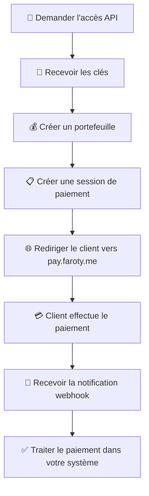

# 🔐 Documentation Sécurité API - Faroty Payment Gateway

## Vue d'ensemble

L'API Faroty Payment Gateway utilise un système de sécurité à deux niveaux :
- **Authentification par clés API** pour les requêtes
- **Signatures webhook** pour les notifications

## 📋 Table des Matières

### 🚀 **Démarrage**
1. [Guide de Démarrage Rapide](#-guide-de-démarrage-rapide)
   - [Étape 1 : Obtenir vos Clés API](#étape-1--obtenir-vos-clés-api)
   - [Étape 2 : Créer votre Premier Portefeuille](#étape-2--créer-votre-premier-portefeuille)
   - [Étape 3 : Créer une Session de Paiement](#étape-3--créer-une-session-de-paiement)
   - [Étape 4 : Rediriger vers l'Interface de Paiement](#étape-4--rediriger-vers-linterface-de-paiement)
   - [Étape 5 : Configurer vos Webhooks](#étape-5--configurer-vos-webhooks)

### 🔐 **Sécurité**
2. [Authentification par Clés API](#-authentification-par-clés-api)
3. [Sécurité des Webhooks](#-sécurité-des-webhooks)
4. [Événements Webhook](#-événements-webhook)

### 🛠️ **Intégration**
5. [SDK et Exemples d'Intégration](#-sdk-et-exemples-dintégration)
6. [Bonnes Pratiques de Sécurité](#️-bonnes-pratiques-de-sécurité)

---

## 🚀 Guide de Démarrage Rapide

Ce guide vous accompagne pas à pas pour intégrer l'API Faroty Payment Gateway dans votre application.

### 💡 **Prérequis**

- ✅ Connaissances de base en développement web
- ✅ Capacité à effectuer des requêtes HTTP/HTTPS
- ✅ Un serveur web pour recevoir les webhooks
- ✅ Un nom de domaine valide (recommandé pour la production)

### 🎯 **Ce que vous obtiendrez**

À la fin de ce guide, vous pourrez :
- ✅ Accepter des paiements par carte bancaire
- ✅ Recevoir des paiements via Orange Money et MTN MoMo
- ✅ Traiter les paiements PayPal
- ✅ Recevoir des notifications en temps réel
- ✅ Gérer les remboursements

### Étape 1 : Obtenir vos Clés API

Pour commencer à utiliser l'API Faroty, vous devez d'abord obtenir vos clés d'authentification.

#### 📞 **Demande d'Accès**

Contactez notre équipe pour obtenir votre compte :
- **Email** : support@faroty.com
- **Formulaire** : [Demande d'accès API](https://faroty.com/api-access)

#### 🔑 **Réception des Clés**

Une fois votre compte créé, vous recevrez :

```json
{
  "account_id": "550e8400-e29b-41d4-a716-446655440000",
  "account_name": "VotreEntreprise",
  "api_keys": {
    "public_key": "fk_test_V9H3cXAcZSl5lP3QvtzzCBHX91ClWG2TGXN5P86KizQiQ82CdoVsnOrnH455wRrOCs7UlHT_0Xc",
    "private_key": "fs_test_m7N0p3Q6r9S2t5U8v1W4x7Y0z3A6b9C2d5E8f1G4h7I0j3K6l9M2n5O8p1Q4r7S0"
  },
  "webhook_secret": "whs_a8B9c7D2e5F1g4H8j3K6m9N2p5Q8r1T4X7Y0z3A6b9C2d5E8f1G4h7I0j3K6",
  "environment": "test"
}
```

### Étape 2 : Créer votre Premier Portefeuille

Avant de pouvoir recevoir des paiements, vous devez créer un portefeuille (wallet) pour encaisser vos fonds.

#### 📋 **Endpoint de Création**

```http
POST https://api-pay.faroty.me/payments/api/v1/wallets
Content-Type: application/json
X-API-Key: fk_test_V9H3cXAcZSl5lP3QvtzzCBHX91ClWG2TGXN5P86KizQiQ82CdoVsnOrnH455wRrOCs7UlHT_0Xc
```

#### 📤 **Données à Envoyer**

```json
{
    "accountId":"9c49fb07-97c0-4cb3-84cb-3d97a07bc771",
    "currencyCode":"XAF",
    "walletType":"PERSONAL",
    "legalIdentifier":"5bdf3222-fea0-4938-82a1-df2955516f25",
    "refId":"5bdf3222-fea0-4938-82a1-df2955516f21"
}
```

#### 📥 **Réponse Attendue**

```json
{
    "success": true,
    "message": "Portefeuille créé avec succès",
    "statusCode": 200,
    "timestamp": "2025-09-20T10:58:08.992742331",
    "data": {
        "id": "d3109bb0-ea14-4975-8072-d6b24fd40b3b",
        "legalIdentifier": "5bdf3222-fea0-4938-82a1-df2955516f25",
        "walletType": "PERSONAL",
        "depositFeeRate": 1.95,
        "maxTransactionAmount": 500000.00,
        "withdrawalFeeRate": 0.00,
        "frozenReason": null,
        "refId": "5bdf3222-fea0-4938-82a1-df2955516f21",
        "refName": null,
        "createdAt": "2025-09-20T11:58:08.878899595+01:00",
        "updatedAt": "2025-09-20T11:58:08.878904314+01:00",
        "currency": {
            "id": "0b465399-e680-4033-b33d-e147de97132f",
            "code": "XAF",
            "nameFr": "Francs CFA",
            "nameEn": "CFA Franc",
            "symbol": "CFA",
            "createdAt": "2025-09-18T12:26:54.335895",
            "updatedAt": "2025-09-18T12:26:54.335971",
            "walletsCount": 0,
            "exchangeRatesCount": 84,
            "active": true
        },
        "account": {
            "id": "9c49fb07-97c0-4cb3-84cb-3d97a07bc771",
            "userId": "df543270-b6ee-4742-a1d8-2f9ecceaa129",
            "accountName": "Asso+",
            "accountSubName": "Asso+ Account",
            "accountMode": "SANDBOX",
            "publicKey": "pk_test_1TluEIlfFDXLWQ96PZv6LAGVcmJeGNBiW4LUdjIntCYyIB7pNlUTIXeRKEEjv-0cp60iWEFVLnU",
            "expiresAt": null,
            "frozenReason": null,
            "depositFeeRate": 0.00,
            "withdrawalFeeRate": 0.00,
            "createdAt": "2025-09-18T13:26:56.108367+01:00",
            "updatedAt": "2025-09-18T13:26:56.108392+01:00",
            "country": {
                "id": "bf0db2d6-57d3-4e3b-a07f-1971ee22a932",
                "code": "CM",
                "nameFr": "Cameroun",
                "nameEn": "Cameroon",
                "maxPaymentAmount": 500000.00,
                "paymentValidationTime": 3,
                "minTransactionFeeRate": 1.95,
                "isUserPaysFees": true,
                "maxWithdrawalAmount": 1000000.00,
                "withdrawalValidationThreshold": 250000.00,
                "isAutoValidateWithdrawals": false,
                "withdrawalValidationTime": 60,
                "withdrawalCooldown": 0,
                "createdAt": "2025-09-18T12:26:54.842771",
                "updatedAt": "2025-09-18T12:26:54.842813",
                "accountsCount": 3,
                "paymentMethodsCount": 7,
                "active": true
            },
            "walletsCount": 1,
            "accountPaymentMethodsCount": 7,
            "webhooksCount": 1,
            "frozen": false
        },
        "balance": null,
        "walletOwners": [],
        "transactionsCount": 0,
        "webhooksCount": 0,
        "suspiciousActivitiesCount": 0,
        "frozen": false
    },
    "pagination": null,
    "metadata": null
}
```

### Étape 3 : Créer une Session de Paiement

Pour chaque paiement, vous devez créer une session qui génère un token unique.

#### 📋 **Endpoint de Création de Session**

```http
POST https://api-pay.faroty.me/payments/api/v1/payment-sessions
Content-Type: application/json
X-API-Key: fk_test_V9H3cXAcZSl5lP3QvtzzCBHX91ClWG2TGXN5P86KizQiQ82CdoVsnOrnH455wRrOCs7UlHT_0Xc
```

#### 📤 **Données à Envoyer**

```json
{
  "walletId": "1e700181-5e7b-4fa2-a617-fa3ea6572292",
  "currencyCode": "XAF",
  "cancelUrl": "/error",
  "successUrl": "/success",
  "type":"DEPOSIT",
  "ipAddress": "1.1.1.1.1.1",
  "amount":100
}
```

#### 📥 **Réponse Attendue**

```json
{
    "success": true,
    "message": "payment.session.created.success",
    "statusCode": 200,
    "timestamp": "2025-09-20T11:42:59.517714",
    "data": {
        "sessionToken": "eaaPxHGa-x4rVPbmN7BYkYeHEAdwAA7F",
        "sessionUrl": "/api/v1/payment-sessions/checkout/eaaPxHGa-x4rVPbmN7BYkYeHEAdwAA7F"
    },
    "pagination": null,
    "metadata": null
}
```

### Étape 4 : Rediriger vers l'Interface de Paiement

Une fois la session créée, redirigez votre client vers l'interface de paiement Faroty.

#### 🌐 **URL de Redirection**

```bash
https://pay.faroty.me/payment?sessionToken=eaaPxHGa-x4rVPbmN7BYkYeHEAdwAA7F
```

#### 🎨 **Interface Client**

Votre client sera redirigé vers une interface sécurisée où il pourra :
- ✅ Choisir sa méthode de paiement (Carte, Orange Money, MTN MoMo, PayPal)
- ✅ Saisir ses informations de paiement
- ✅ Confirmer la transaction

### Étape 5 : Configurer vos Webhooks

Pour recevoir les notifications de paiement en temps réel, configurez votre URL de webhook.

#### 📋 **Endpoint de Configuration**

```http
POST https://api-pay.faroty.me/payments/api/v1/webhooks
Content-Type: application/json
X-API-Key: fk_test_V9H3cXAcZSl5lP3QvtzzCBHX91ClWG2TGXN5P86KizQiQ82CdoVsnOrnH455wRrOCs7UlHT_0Xc
```

#### 📤 **Données à Envoyer**

```json
{
  "url": "https://votre-domainte.example.com/webhooks/callback",
  "events": [
    "TRANSACTION_CREATED",
    "PAYMENT_SUCCESS", 
    "TRANSACTION_FAILED",
    "PAYMENT_REFUNDED"
  ],
  "exclusive": false,
  "allowMultiple": true,
  "description": "Webhook de test pour les notifications de transaction",
  "walletId": null,
  "metadata": {
    "applicationName": "Mon App Test",
    "apiVersion": "v1",
    "tags": ["test", "development"],
    "customData": "Données personnalisées"
  }
}
```

#### 📥 **Réponse Attendue**

```json
{
    "success": true,
    "message": "Webhook créé avec succès",
    "statusCode": 0,
    "timestamp": "2025-09-20T06:43:37.316469",
    "data": {
        "id": "905ba84a-1fd4-4ae6-af4f-1ead4aba6c5c",
        "url": "https://votre-domainte.example.com/webhooks/callback",
        "status": "ACTIVE",
        "retryCount": 0,
        "lastAttempt": null,
        "lastError": null,
        "exclusive": false,
        "allowMultiple": true,
        "description": null,
        "createdAt": "2025-09-20T06:43:37.254364",
        "updatedAt": "2025-09-20T06:43:37.254386",
        "events": [
            "PAYMENT_SUCCESS",
            "PAYMENT_REFUNDED",
            "TRANSACTION_CREATED",
            "TRANSACTION_FAILED"
        ],
        "wallet": null,
        "account": {
            "id": "c08ef128-1b56-430b-ba7b-94188686dbbd",
            "accountName": "Asso+",
            "accountSubName": "Asso+ Account"
        },
        "metadata": null
    },
    "pagination": null,
    "metadata": null
}
```

#### 🔔 **Exemple de Notification Reçue**

Lorsqu'un paiement est effectué, vous recevrez une notification POST sur votre URL :

```http
POST https://votre-site.com/webhook/faroty
Content-Type: application/json
X-Webhook-Signature: a1b2c3d4e5f6...
X-Webhook-Timestamp: 1695134567890
```

```json
{
  "event": "payment_success",
  "transaction_id": "550e8400-e29b-41d4-a716-446655440000",
  "wallet_id": "wallet-550e8400-e29b-41d4-a716-446655440000",
  "account_id": "550e8400-e29b-41d4-a716-446655440000",
  "amount": 100.00,
  "currency": "EUR",
  "status": "SUCCESS",
  "type": "DEPOSIT",
  "provider_reference": "pay_1234567890",
  "timestamp": "2024-01-15T10:30:00Z",
  "session": {
    "session_id": "77DfFDVzo8ov6FRMy0fUtXyhzjsZlTBB",
    "title": "Achat Produit Premium",
    "metadata": {
      "order_id": "ORDER-123456",
      "customer_id": "CUST-789"
    }
  },
  "pay_metadata": {
    "provider": "stripe",
    "payment_intent_id": "pi_1234567890"
  }
}
```

### 🎯 **Récapitulatif du Workflow**



### ⚡ **Exemple Complet d'Intégration**

```javascript
// 1. Créer une session de paiement
const session = await fetch('https://api-pay.faroty.me/payments/api/v1/payment-sessions', {
  method: 'POST',
  headers: {
    'Content-Type': 'application/json',
    'X-API-Key': 'fk_test_V9H3cXAcZSl5lP3QvtzzCBHX91ClWG2TGXN5P86KizQiQ82CdoVsnOrnH455wRrOCs7UlHT_0Xc'
  },
  body: JSON.stringify({
    walletId: 'wallet-550e8400-e29b-41d4-a716-446655440000',
    amount: 100.00,
    currency: 'EUR',
    title: 'Achat Produit Premium',
    successUrl: 'https://votre-site.com/success',
    cancelUrl: 'https://votre-site.com/cancel'
  })
});

const sessionData = await session.json();

// 2. Rediriger vers l'interface de paiement
window.location.href = sessionData.data.checkoutUrl;
```

### ❓ **Questions Fréquentes**

#### **Q: Combien de temps faut-il pour obtenir l'accès à l'API ?**
R: Généralement 24-48h après votre demande d'accès. Notre équipe vous contactera pour valider votre projet.

#### **Q: Puis-je tester l'API sans créer de compte ?**
R: Non, vous devez obtenir vos clés API pour accéder aux endpoints. Cependant, l'environnement de test est gratuit.

#### **Q: Quelles devises sont supportées ?**
R: EUR, XAF, USD principalement. Contactez-nous pour d'autres devises.

#### **Q: Les webhooks sont-ils obligatoires ?**
R: Recommandés pour une expérience optimale. Vous pouvez aussi vérifier le statut des paiements via l'API.

#### **Q: Comment tester les webhooks en local ?**
R: Utilisez des outils comme ngrok pour exposer votre serveur local : `ngrok http 3000`

---

## 🔑 Authentification par Clés API

### Obtention des Clés

Chaque compte Faroty dispose de deux clés :
- **Clé publique** : `fk_test_xxx` (utilisée pour l'authentification API)
- **Clé privée** : `fs_test_xxx` (réservée pour usage futur)

> **Important** : Actuellement, seules les clés publiques sont utilisées pour l'authentification. Les clés privées seront utilisées pour les fonctionnalités avancées (signatures de requêtes critiques).

### 🏷️ **Format des Préfixes Faroty**

Faroty utilise des préfixes uniques pour éviter toute confusion avec d'autres services :

```bash
# Clés de Test (Sandbox)
fk_test_a8B9c7D2e5F1g4H8j3K6m9N2p5Q8r1T4  # Clé publique test (Faroty Key Test)
fs_test_x2Y5z8A1b4C7d0E3f6G9h2I5j8K1l4M7  # Clé secrète test (Faroty Secret Test)

# Clés de Production
fk_live_p8Q1r4S7t0U3v6W9x2Y5z8A1b4C7d0E3  # Clé publique production (Faroty Key Live)
fs_live_m7N0p3Q6r9S2t5U8v1W4x7Y0z3A6b9C2  # Clé secrète production (Faroty Secret Live)
```

**Signification des préfixes :**
- `fk_` = **F**aroty **K**ey (Clé publique)
- `fs_` = **F**aroty **S**ecret (Clé privée)
- `test_` = Environnement de test
- `live_` = Environnement de production

### Utilisation

Incluez votre clé publique dans le header `X-API-Key` de chaque requête :

```bash
curl -X POST https://api-pay.faroty.me/payments/api/v1/payments/initialization/initialize \
  -H "Content-Type: application/json" \
  -H "X-API-Key: fk_test_V9H3cXAcZSl5lP3QvtzzCBHX91ClWG2TGXN5P86KizQiQ82CdoVsnOrnH455wRrOCs7UlHT_0Xc" \
  -d '{
    "sessionToken": "gE5WVhdgYu_F1TsbSVZNQmB3MZnknj-W",
    "selectedPaymentMethod": "CARD",
    "preferredCurrency": "EUR"
  }'
```

### Endpoints Sécurisés

Les endpoints suivants nécessitent une authentification par clé API :

| Endpoint | Méthode | Description |
|----------|---------|-------------|
| `/api/v1/payments/initialization/initialize` | POST | Initialiser un paiement |
| `/api/v1/payments/initialization/methods/{token}` | GET | Récupérer les méthodes de paiement |
| `/api/v1/withdrawals/initialize` | POST | Initialiser un retrait |

### Réponses d'Erreur

```json
// 401 - Clé API manquante
{
  "success": false,
  "message": "Clé API requise",
  "statusCode": 401,
  "timestamp": "2025-09-19T15:26:57.391349"
}

// 401 - Clé API invalide
{
  "success": false,
  "message": "Clé API invalide",
  "statusCode": 401,
  "timestamp": "2025-09-19T15:26:57.391349"
}
```

---

## 🔔 Sécurité des Webhooks

### Réception de Webhooks

Lorsque Faroty vous envoie des notifications webhook, chaque requête est signée avec un secret unique.

### Headers de Sécurité

```http
POST /votre-endpoint-webhook HTTP/1.1
Content-Type: application/json
User-Agent: Faroty-Payment-Service/1.0
X-Webhook-Event: payment.success
X-Webhook-Signature: a1b2c3d4e5f6...
X-Webhook-Timestamp: 1695134567890
```

### Validation de la Signature

#### JavaScript/Node.js

```javascript
const crypto = require('crypto');

function validateWebhook(payload, signature, secret, timestamp) {
  // 1. Vérifier que le timestamp est récent (< 5 minutes)
  const currentTime = Math.floor(Date.now() / 1000);
  const webhookTime = Math.floor(parseInt(timestamp) / 1000);
  
  if (Math.abs(currentTime - webhookTime) > 300) {
    throw new Error('Webhook timestamp trop ancien');
  }
  
  // 2. Générer la signature attendue
  const expectedSignature = crypto
    .createHmac('sha256', secret)
    .update(payload)
    .digest('hex');
  
  // 3. Comparer les signatures de manière sécurisée
  return crypto.timingSafeEqual(
    Buffer.from(signature, 'hex'),
    Buffer.from(expectedSignature, 'hex')
  );
}

// Utilisation dans Express.js
app.post('/webhook/faroty', express.raw({type: 'application/json'}), (req, res) => {
  const payload = req.body.toString();
  const signature = req.headers['x-webhook-signature'];
  const timestamp = req.headers['x-webhook-timestamp'];
  const secret = 'votre_secret_webhook'; // Récupéré depuis votre configuration
  
  try {
    if (!validateWebhook(payload, signature, secret, timestamp)) {
      return res.status(401).send('Signature invalide');
    }
    
    // Traiter le webhook authentique
    const event = JSON.parse(payload);
    console.log('Événement reçu:', event.eventType);
    
    res.status(200).send('OK');
  } catch (error) {
    console.error('Erreur webhook:', error.message);
    res.status(400).send('Erreur de validation');
  }
});
```

#### PHP

```php
<?php
function validateWebhook($payload, $signature, $secret, $timestamp) {
    // 1. Vérifier le timestamp
    $currentTime = time();
    $webhookTime = intval($timestamp / 1000);
    
    if (abs($currentTime - $webhookTime) > 300) {
        throw new Exception('Webhook timestamp trop ancien');
    }
    
    // 2. Générer la signature attendue
    $expectedSignature = hash_hmac('sha256', $payload, $secret);
    
    // 3. Comparer de manière sécurisée
    return hash_equals($signature, $expectedSignature);
}

// Utilisation
$payload = file_get_contents('php://input');
$signature = $_SERVER['HTTP_X_WEBHOOK_SIGNATURE'] ?? '';
$timestamp = $_SERVER['HTTP_X_WEBHOOK_TIMESTAMP'] ?? '';
$secret = 'votre_secret_webhook';

try {
    if (!validateWebhook($payload, $signature, $secret, $timestamp)) {
        http_response_code(401);
        exit('Signature invalide');
    }
    
    $event = json_decode($payload, true);
    error_log('Événement reçu: ' . $event['eventType']);
    
    http_response_code(200);
    echo 'OK';
} catch (Exception $e) {
    error_log('Erreur webhook: ' . $e->getMessage());
    http_response_code(400);
    exit('Erreur de validation');
}
?>
```

#### Python

```python
import hmac
import hashlib
import time
import json

def validate_webhook(payload, signature, secret, timestamp):
    # 1. Vérifier le timestamp
    current_time = int(time.time())
    webhook_time = int(timestamp) // 1000
    
    if abs(current_time - webhook_time) > 300:
        raise ValueError('Webhook timestamp trop ancien')
    
    # 2. Générer la signature attendue
    expected_signature = hmac.new(
        secret.encode('utf-8'),
        payload.encode('utf-8'),
        hashlib.sha256
    ).hexdigest()
    
    # 3. Comparer de manière sécurisée
    return hmac.compare_digest(signature, expected_signature)

# Utilisation avec Flask
from flask import Flask, request

app = Flask(__name__)

@app.route('/webhook/faroty', methods=['POST'])
def handle_webhook():
    payload = request.get_data(as_text=True)
    signature = request.headers.get('X-Webhook-Signature')
    timestamp = request.headers.get('X-Webhook-Timestamp')
    secret = 'votre_secret_webhook'
    
    try:
        if not validate_webhook(payload, signature, secret, timestamp):
            return 'Signature invalide', 401
        
        event = json.loads(payload)
        print(f'Événement reçu: {event["eventType"]}')
        
        return 'OK', 200
    except Exception as e:
        print(f'Erreur webhook: {e}')
        return 'Erreur de validation', 400
```

---

## 🎯 Événements Webhook

### Types d'Événements

| Événement | Description | Payload |
|-----------|-------------|---------|
| `payment_success` | Paiement réussi | Transaction complète avec session |
| `payment_failure` | Paiement échoué | Détails de l'erreur avec session |
| `payment_cancelled` | Paiement annulé | Transaction annulée |
| `payment_refund` | Remboursement effectué | Détails du remboursement |
| `transaction_status_changed` | Changement de statut | Ancien et nouveau statut |

### Exemples de Payloads

#### Paiement Réussi (`payment_success`)

```json
{
  "event": "payment_success",
  "transaction_id": "550e8400-e29b-41d4-a716-446655440000",
  "wallet_id": "wallet-uuid-here",
  "account_id": "account-uuid-here",
  "amount": 100.00,
  "currency": "EUR",
  "status": "SUCCESS",
  "type": "DEPOSIT",
  "provider_reference": "pay_1234567890",
  "timestamp": "2024-01-15T10:30:00Z",
  "operator_fee": false,
  "session": {
    "session_id": "session-uuid-here",
    "checkout_token": "checkout-token-here",
    "status": "CONSUMED",
    "pay_with_withdrawal_fee": false,
    "consumed_at": "2024-01-15T10:30:00Z",
    "title": "Achat produit",
    "description": "Description du paiement",
    "image_url": "https://example.com/image.jpg",
    "metadata": {},
    "content_type": "PAYMENT",
    "dynamic_content": {}
  },
  "pay_metadata": {
    "provider": "stripe",
    "payment_intent_id": "pi_1234567890"
  }
}
```

#### Paiement Échoué (`payment_failure`)

```json
{
  "event": "payment_failure",
  "transaction_id": "550e8400-e29b-41d4-a716-446655440000",
  "wallet_id": "wallet-uuid-here",
  "account_id": "account-uuid-here",
  "amount": 100.00,
  "currency": "EUR",
  "status": "FAILED",
  "type": "DEPOSIT",
  "provider_reference": "pay_1234567890",
  "timestamp": "2024-01-15T10:30:00Z",
  "operator_fee": false,
  "session": {
    "session_id": "session-uuid-here",
    "checkout_token": "checkout-token-here",
    "status": "FAILED",
    "pay_with_withdrawal_fee": false,
    "consumed_at": "2024-01-15T10:30:00Z",
    "title": "Achat produit",
    "description": "Description du paiement",
    "image_url": null,
    "metadata": {},
    "content_type": "PAYMENT",
    "dynamic_content": {}
  },
  "error_message": "Paiement échoué",
  "pay_metadata": {
    "error": "card_declined",
    "error_description": "Your card was declined."
  }
}
```

#### Remboursement (`payment_refund`)

```json
{
  "event": "payment_refund",
  "transaction_id": "550e8400-e29b-41d4-a716-446655440000",
  "refund_id": "ref_1234567890",
  "wallet_id": "wallet-uuid-here",
  "account_id": "account-uuid-here",
  "amount": 100.00,
  "currency": "EUR",
  "status": "REFUNDED",
  "type": "DEPOSIT",
  "provider_reference": "pay_1234567890",
  "timestamp": "2024-01-15T10:30:00Z",
  "operator_fee": false,
  "session": {
    "session_id": "session-uuid-here",
    "checkout_token": "checkout-token-here",
    "status": "CONSUMED",
    "pay_with_withdrawal_fee": false,
    "consumed_at": "2024-01-15T10:30:00Z",
    "title": "Achat produit",
    "description": "Description du paiement",
    "image_url": null,
    "metadata": {},
    "content_type": "PAYMENT",
    "dynamic_content": {}
  },
  "reason": "Remboursement demandé par le client",
  "pay_metadata": {
    "refund_id": "re_1234567890",
    "original_payment_intent": "pi_1234567890"
  }
}
```

### Structure des Champs

| Champ | Type | Description |
|-------|------|-------------|
| `event` | String | Type d'événement (`payment_success`, `payment_failure`, etc.) |
| `transaction_id` | UUID | Identifiant unique de la transaction |
| `wallet_id` | UUID | Identifiant du portefeuille |
| `account_id` | UUID | Identifiant du compte |
| `amount` | Decimal | Montant de la transaction |
| `currency` | String | Code de devise (EUR, XAF, USD, etc.) |
| `status` | String | Statut de la transaction (SUCCESS, FAILED, REFUNDED) |
| `type` | String | Type de transaction (DEPOSIT, WITHDRAWAL) |
| `provider_reference` | String | Référence du fournisseur de paiement |
| `timestamp` | ISO8601 | Horodatage de la transaction |
| `operator_fee` | Boolean | Frais d'opérateur appliqués |
| `session` | Object | Informations de la session de paiement |
| `pay_metadata` | Object | Métadonnées spécifiques au fournisseur |
| `error_message` | String | Message d'erreur (pour les échecs) |
| `refund_id` | String | Identifiant du remboursement |
| `reason` | String | Raison du remboursement |

---

## 🛡️ Bonnes Pratiques de Sécurité

### 1. Protection des Clés API

```bash
# ✅ FAIRE
export FAROTY_API_KEY="pk_live_xxx"
curl -H "X-API-Key: $FAROTY_API_KEY" ...

# ❌ NE PAS FAIRE
curl -H "X-API-Key: pk_live_xxx" ... # Clé visible dans l'historique
```

### 2. Validation des Webhooks

```javascript
// ✅ TOUJOURS valider la signature
if (!validateWebhookSignature(payload, signature, secret)) {
  return res.status(401).send('Unauthorized');
}

// ✅ TOUJOURS vérifier le timestamp
if (isTimestampExpired(timestamp)) {
  return res.status(401).send('Timestamp expired');
}

// ✅ TOUJOURS utiliser HTTPS en production
const webhookUrl = 'https://votre-domaine.com/webhook/faroty';
```

### 3. Gestion des Erreurs

```javascript
// ✅ Répondre rapidement pour éviter les retries
app.post('/webhook', (req, res) => {
  try {
    // Validation rapide
    validateWebhook(req.body, req.headers);
    
    // Répondre immédiatement
    res.status(200).send('OK');
    
    // Traitement asynchrone
    processWebhookAsync(req.body);
    
  } catch (error) {
    res.status(400).send('Error');
  }
});
```

---

## 🚀 SDK et Exemples d'Intégration

### SDK JavaScript (Recommandé)

```javascript
class FarotyPaymentSDK {
  constructor(options) {
    this.apiKey = options.apiKey;
    this.baseURL = options.baseURL || 'https://api-pay.faroty.me/payments';
    this.timeout = options.timeout || 30000;
  }
  
  async initializePayment(data) {
    const response = await fetch(`${this.baseURL}/api/v1/payments/initialization/initialize`, {
      method: 'POST',
      headers: {
        'Content-Type': 'application/json',
        'X-API-Key': this.apiKey
      },
      body: JSON.stringify(data)
    });
    
    if (!response.ok) {
      throw new Error(`API Error: ${response.status}`);
    }
    
    return await response.json();
  }
  
  validateWebhook(payload, signature, secret, timestamp) {
    // Implémentation de validation
    return validateWebhook(payload, signature, secret, timestamp);
  }
}

// Utilisation
const faroty = new FarotyPaymentSDK({
  apiKey: 'fk_test_V9H3cXAcZSl5lP3QvtzzCBHX91ClWG2TGXN5P86KizQiQ82CdoVsnOrnH455wRrOCs7UlHT_0Xc'
});

const payment = await faroty.initializePayment({
  sessionToken: 'session-token',
  selectedPaymentMethod: 'CARD',
  preferredCurrency: 'EUR'
});
```

---

## 🔧 Configuration et Test

### Variables d'Environnement

```bash
# Clés API
FAROTY_API_KEY_TEST=fk_test_xxx
FAROTY_API_KEY_LIVE=fk_live_xxx

# Webhooks
FAROTY_WEBHOOK_SECRET=whs_a8B9c7D2e5F1g4H8j3K6m9N2p5Q8r1T4
FAROTY_WEBHOOK_URL=https://votre-domaine.com/webhook/faroty
```

### Test de Connectivité

```bash
# Test d'authentification
curl -X GET https://api-pay.faroty.me/payments/api/v1/security/test \
  -H "X-API-Key: fk_test_xxx"

# Réponse attendue
{
  "success": true,
  "message": "Authentification Spring Security réussie",
  "data": {
    "authenticated": true,
    "accountName": "VotreCompte",
    "accountMode": "SANDBOX"
  }
}
```

---

## ⚠️ Gestion des Erreurs

### Codes d'Erreur API

| Code | Message | Action |
|------|---------|--------|
| `401` | Clé API manquante | Ajouter header `X-API-Key` |
| `401` | Clé API invalide | Vérifier la clé et le mode |
| `403` | Compte suspendu | Contacter le support |
| `429` | Rate limit dépassé | Réduire la fréquence |

### Codes d'Erreur Webhook

| Code | Message | Action |
|------|---------|--------|
| `401` | Signature invalide | Vérifier le secret webhook |
| `400` | Timestamp expiré | Vérifier l'horloge système |
| `422` | Payload invalide | Vérifier le format JSON |

---

## 🔒 Sécurité Avancée

### Rate Limiting

```javascript
// Respectez les limites de taux
const rateLimiter = {
  maxRequestsPerHour: 1000  // 1000 requêtes par heure
};
```

### Gestion des Secrets

```javascript
// ✅ Stocker les secrets de manière sécurisée
const config = {
  apiKey: process.env.FAROTY_API_KEY,
  webhookSecret: process.env.FAROTY_WEBHOOK_SECRET
};

// ❌ Ne jamais hardcoder les secrets
const config = {
  apiKey: 'pk_live_xxx', // DANGEREUX !
  webhookSecret: 'secret' // DANGEREUX !
};
```

### Monitoring et Logs

```javascript
// Loggez toujours les événements de sécurité
console.log(`[SECURITY] API call from IP: ${clientIp}, Account: ${accountName}`);
console.log(`[WEBHOOK] Event received: ${eventType}, Valid: ${isValid}`);
```

---

## 📋 Checklist d'Intégration

### Avant la Mise en Production

- [ ] Clés API configurées et testées
- [ ] Webhooks configurés avec HTTPS
- [ ] Validation des signatures implémentée
- [ ] Gestion des erreurs implémentée
- [ ] Logs de sécurité configurés
- [ ] Tests de connectivité passés
- [ ] ⚠️ **Important** : Toutes les transactions sont réelles

### Monitoring

- [ ] Alertes sur les échecs d'authentification
- [ ] Surveillance des webhooks échoués
- [ ] Métriques de performance API
- [ ] Rotation régulière des secrets

---

## 🆘 Support et Contact

### Environnement

- **API Base URL** : `https://api-pay.faroty.me/payments`

> **Note** : Actuellement, toutes les transactions sont réelles. Des environnements sandbox seront disponibles après le MVP.

### Contact Technique

- **Email** : technology@faroty.com
- **Documentation** : https://docs.faroty.com
- **Status** : https://status.faroty.com

---

## 📚 Exemples Complets

### Intégration E-commerce

```javascript
class FarotyEcommerce {
  constructor(apiKey) {
    this.sdk = new FarotyPaymentSDK({ apiKey });
  }
  
  async processOrder(order) {
    try {
      // 1. Créer la session de paiement
      const session = await this.createPaymentSession(order);
      
      // 2. Initialiser le paiement
      const payment = await this.sdk.initializePayment({
        sessionToken: session.token,
        selectedPaymentMethod: order.paymentMethod,
        preferredCurrency: order.currency
      });
      
      return payment;
      
    } catch (error) {
      console.error('Erreur paiement:', error.message);
      throw error;
    }
  }
  
  handleWebhook(req, res) {
    const { payload, signature, timestamp } = this.extractWebhookData(req);
    
    if (!this.sdk.validateWebhook(payload, signature, this.webhookSecret, timestamp)) {
      return res.status(401).send('Unauthorized');
    }
    
    const event = JSON.parse(payload);
    
    switch (event.eventType) {
      case 'payment.success':
        this.handlePaymentSuccess(event.data);
        break;
      case 'payment.failed':
        this.handlePaymentFailure(event.data);
        break;
    }
    
    res.status(200).send('OK');
  }
}
```

### Intégration Mobile (React Native)

```javascript
import AsyncStorage from '@react-native-async-storage/async-storage';

class FarotyMobile {
  constructor() {
    this.apiKey = null;
  }
  
  async initialize() {
    this.apiKey = await AsyncStorage.getItem('FAROTY_API_KEY');
  }
  
  async makePayment(paymentData) {
    const response = await fetch('https://api-pay.faroty.me/payments/api/v1/payments/initialization/initialize', {
      method: 'POST',
      headers: {
        'Content-Type': 'application/json',
        'X-API-Key': this.apiKey
      },
      body: JSON.stringify(paymentData)
    });
    
    if (!response.ok) {
      const error = await response.json();
      throw new Error(error.message);
    }
    
    return await response.json();
  }
}
```

---

*Cette documentation couvre l'intégration complète et sécurisée avec l'API Faroty Payment Gateway. Pour des questions spécifiques, contactez notre équipe technique.*
